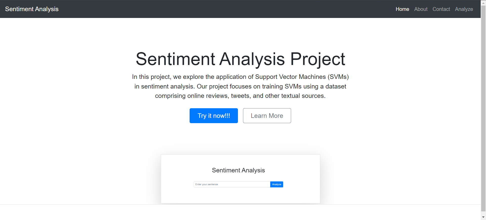
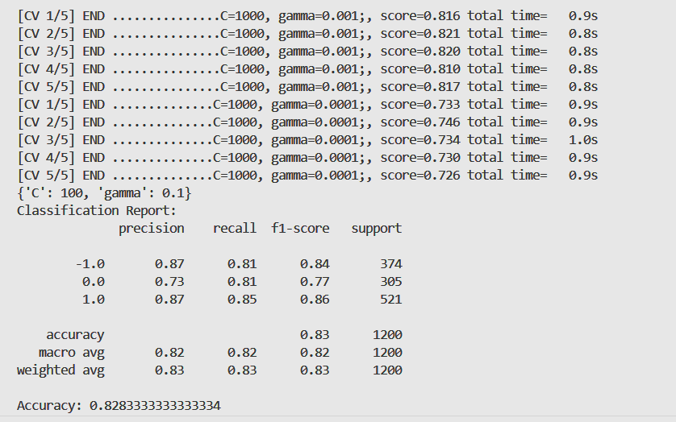
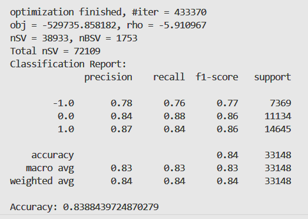

# Sentiment Analysis Using SVM

Sentiment analysis, a subfield of natural language processing (NLP), plays a crucial role in
understanding the opinions and emotions expressed in textual data. 

This project focuses on training SVMs using a dataset comprising online reviews, tweets, and other textual sources. The dataset is labelled with sentiment labels such as positive, negative, and neutral. By leveraging the features extracted from the text, SVMs learn to classify new instances into one of these sentiment categories.

## Installation

1. **Clone the Repository**:
    ```bash
    git clone https://github.com/vardanskamra/sentiment_analysis
    cd sentiment_analysis
    ```

2. **Create a Virtual Environment**:
    ```bash
    python -m venv venv
    ```

    On macOS/Linux:
    ```bash
    source venv/bin/activate
    ``` 

    On Windows:
    ```bash
    venv\Scripts\activate
    ```

3. **Install Python Dependencies**:
    ```bash
    pip install -r requirements.txt
    ```

4. **Install NLTK Data**: Run the following Python script to download necessary NLTK data:
    ```bash
    python nltkinstaller.py
    ```

5. **Install Node.js Dependencies**: Still in the project directory, run the following command to install Node.js dependencies:
    ```bash
    npm install
    ```

## Running the Web Application

- **Start the Server**: After installing dependencies, start the server by running:
    ```bash
    npm start
    ```

- **Access the Application**: Once the server is running, access the application by opening a web browser and navigating to `http://localhost:3000`.


## Design and Architecture

### Preprocessing
- We preprocess the textual data by removing noise, tokenizing the text, and applying techniques such as stemming or lemmatization to normalize the text. 

- Feature engineering plays a vital role in SVMs, where we represent each text instance as a vector in a high-dimensional space. This vectorization process transforms the text into a format suitable for SVM classification.

### Training
- We train the SVM model on a portion of the dataset and evaluate its performance using various metrics such as accuracy, precision, recall, and F1-score. 

- Additionally, we employ techniques like cross-validation to ensure the robustness of our model and to prevent overfitting.

- GridSearch CV is helpful to find the best hyperparameters.


### Evaluation Metrics
- The model presents an accuracy of 84%, which seems really good for a support vector macine.


**For more details, have a look at the [Project Report](./docs/Sentiment%20Analysis%20Using%20SVM.pdf).**

## License

This project is licensed under the MIT License - see the [LICENSE](LICENSE.txt) file for details.
